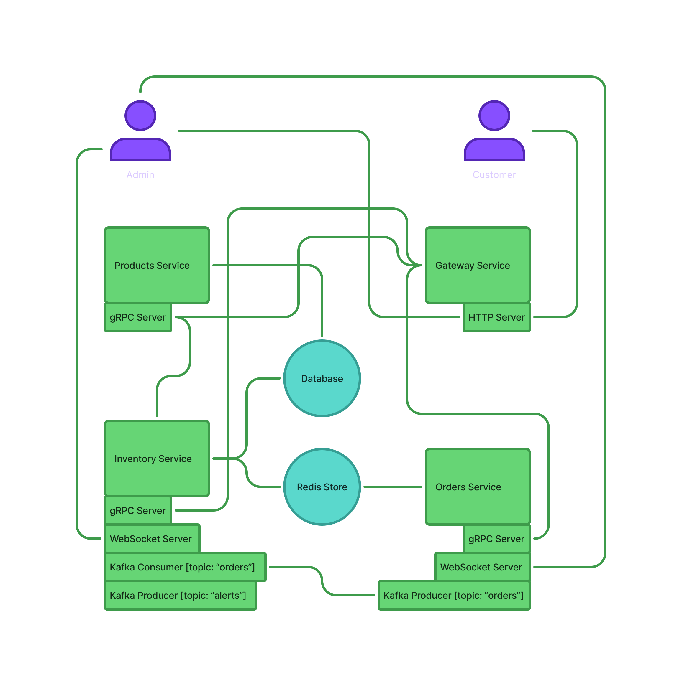

# Inventory Management System

> *"It's not just another inventory management system."*

---

## ✨ Features
- **Microservices** architecture  
- Heavy order handling with **Kafka**  
- Inter-service communication using **gRPC**  
- Real-time order updates with **WebSockets**  

---

## 💡 The Thought
> Thinking of a well-known manufacturer with the need for an online store to handle a large number of products and orders.

---

## 📌 Requirements
- Process **millions** of orders and inventory updates smoothly  
- Performant dashboard with **real-time updates**  

---

## 🏗️ Why Microservices
Separation of modules makes sense in this system since maintainability and scalability are considerably easier.  
Handling a large number of requests can cause crashes, so eliminating a **single point of failure** is essential.  
That’s why microservices are the best fit.

---

## 🧩 System Components
- **Products Service** → Manage products and related assets  
- **Inventory Service** → Handle stock levels and send low stock alerts  
- **Orders Service** → Place orders and update order status  

---

## 🔐 Architecture Design

---

## ⚙️ Technology Justification

### Go Language
- Built-in concurrency with **goroutines**  
- Simplicity + strong standard library  
- Efficient for microservices and high-load systems  

### gRPC
- Faster than traditional HTTP/JSON communication  
- Uses **Protobuf** for consistent, efficient data exchange  

### Kafka
- Reliable **event streaming** and delivery  
- Scales seamlessly with high order volumes  
- Ensures order placement consistency  

### Consul
- Enables **service discovery**  
- Future-proofing for additional services (payments, invoices, monitoring, etc.)  

### Docker
- Manages **Kafka consumers/producers**, MySQL DB, and Consul client in isolated containers  

### Redis Store
- **In-memory storage** for speed:  
  - Recent order details  
  - Stock movement data  
  - Low stock alerts  
- Boosts dashboard performance  

---

## 🌐 Gateway
Acts as a **single entry point** to all services.  
- More secure (expose only what’s needed)  
- Centralized authentication  

---

## 🔄 System Flow
1. Customer places an order via **Gateway Service**  
2. Gateway → Orders Service → Kafka (`orders_events` topic)  
3. Inventory Service listens to Kafka events → updates stock levels  
4. **WebSocket servers** push real-time updates:  
   - Orders → dashboard  
   - Stock alerts → admin dashboard  

---

## 📊 Dashboards

### Customer
- Place orders  
- View products  

### Admin
- **Products** → Manage products  
- **Inventory** → Real-time stock levels, low stock alerts  
- **Orders** → Real-time updates, view & manage orders  

---

## 🚀 Future Enhancements
- Alert service (SMS/Email notifications)  
- Customer management (registration, login, wishlist, profiles)  
- Customer analytics (product/order-based insights)  
- Auto-refill stock feature  
- Personalized product recommendations  

---

## 🔧 Implementation
👉 [View GitHub Repo](https://github.com/logan2k02/ims)  

---

Thanks for reading this far! 🙂
